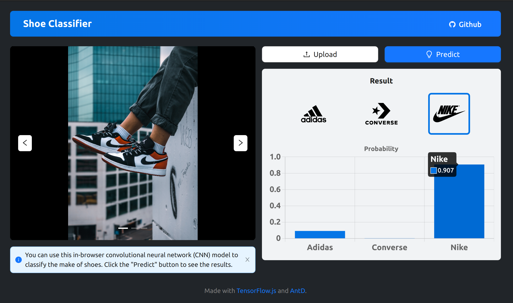

# Shoe Classifier

> An in-browser convolutional neural network (CNN) model used to classify the brand of shoes in images.

*Note: As of now, it only supports Nike, Adidas and Converse.*

## Demo

<https://shoeclass.wtongze.com>

## Model

The CNN model is trained using the "Nike, Adidas and Converse Shoes Images" dataset on Kaggle.

<https://www.kaggle.com/datasets/die9origephit/nike-adidas-and-converse-imaged>

You can find the details on how I build this model by open the `cnn.ipynb` Jupyter Notebook in the project directory or using the following link:

<https://github.com/wtongze/shoe-classifier/blob/main/cnn.ipynb>

## Tech Stack

- TensorFlow
- TensorFlow.js
- Ant Design
- React.js

## Scripts

In the project directory, you can run:

### `npm start`

Runs the app in the development mode.\
Open [http://localhost:3000](http://localhost:3000) to view it in the browser.

The page will reload if you make edits.\
You will also see any lint errors in the console.

### `npm run build`

Builds the app for production to the `build` folder.\
It correctly bundles React in production mode and optimizes the build for the best performance.

The build is minified and the filenames include the hashes.\
Your app is ready to be deployed!

See the section about [deployment](https://facebook.github.io/create-react-app/docs/deployment) for more information.
